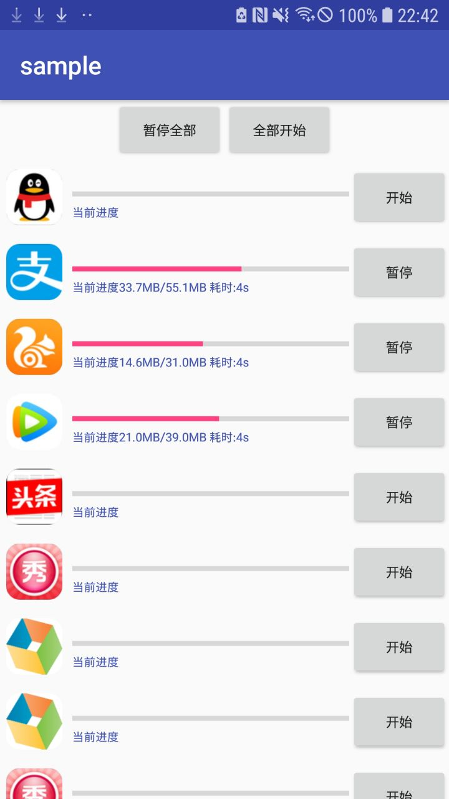
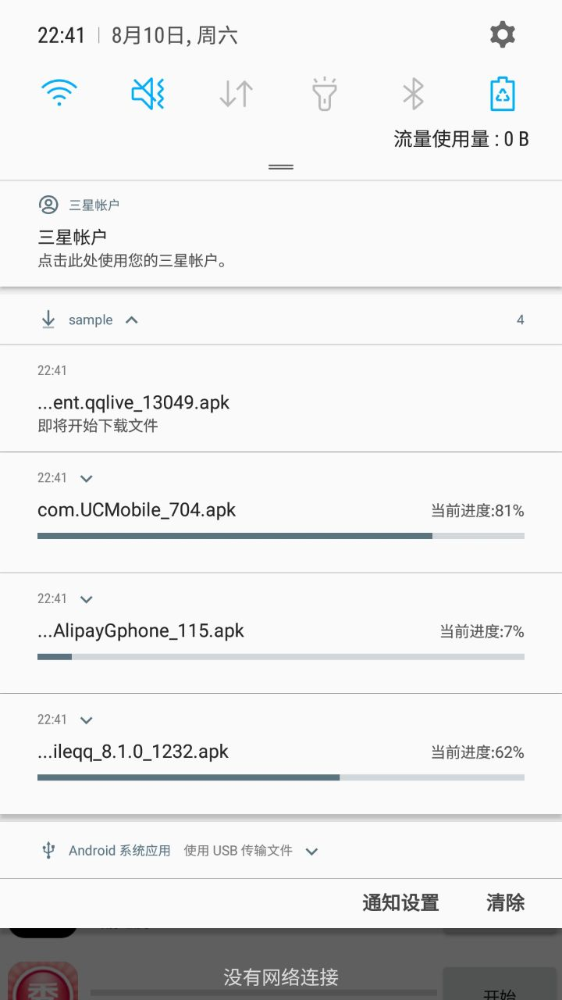

## Downloader
Downloader 是一个非常轻巧以及功能强大快速下载库，只有50KB 左右大小，对于大多数应用来说，性价比最高的一个下载库， 相比系统提供DownloadManager、FileDownloader 来说，Downloader 提供的API更简单、轻量且Downloader提供同步下载，系统通知进度等功能。

## 预览图

<a href="img/download1.jpg"></a> <a href="img/download2.jpg"></a> 

## 特性

* 支持串行，多线程并行下载
* 支持断点续传
* 支持分块传输
* 支持系统通知进度
* 支持同步,异步下载
* 支持自义定路径
* 支持添加请求头
* 支持超时配置
* 提供简易的Api
* 支持重定向下载
* 支持进度回调
* 重试次数配置
* 支持下载APK文件完成后自动安装
* 支持暂停，恢复下载等操作

## 下载
```
allprojects {
	repositories {
			...
			maven { url 'https://jitpack.io' }
	}
}
```

```
implementation 'com.download.library:Downloader:4.1.3'
```

## 例子

#### 同步
```java
File file = DownloadImpl.getInstance()
				.with(getApplicationContext())
				.url("http://shouji.360tpcdn.com/170918/93d1695d87df5a0c0002058afc0361f1/com.ss.android.article.news_636.apk")
				.get();
```

#### 异步
```java
DownloadImpl.getInstance()
                .with(getApplicationContext())
                .url("http://shouji.360tpcdn.com/170918/f7aa8587561e4031553316ada312ab38/com.tencent.qqlive_13049.apk")
                .enqueue();
```

#### 进度监听
```java
DownloadImpl.getInstance()
		.with(getApplicationContext())
		.target(new File(this.getExternalCacheDir(), "com.ss.android.article.news_636.apk"))
		.setUniquePath(false)
		.setForceDownload(true)
.url("http://shouji.360tpcdn.com/170918/93d1695d87df5a0c0002058afc0361f1/com.ss.android.article.news_636.apk")
		.enqueue(new DownloadListenerAdapter() {
					@Override
					public void onStart(String url, String userAgent, String contentDisposition, String mimetype, long contentLength, Extra extra) {
						super.onStart(url, userAgent, contentDisposition, mimetype, contentLength, extra);
					}

					@Override
					public void onProgress(String url, long downloaded, long length, long usedTime) {
						super.onProgress(url, downloaded, length, usedTime);
						Log.i(TAG, " progress:" + downloaded + " url:" + url);
					}

					@Override
					public boolean onResult(Throwable throwable, Uri path, String url, Extra extra) {
						Log.i(TAG, " path:" + path + " url:" + url + " length:" + new File(path.getPath()).length());
						return super.onResult(throwable, path, url, extra);
					}
		});
```

